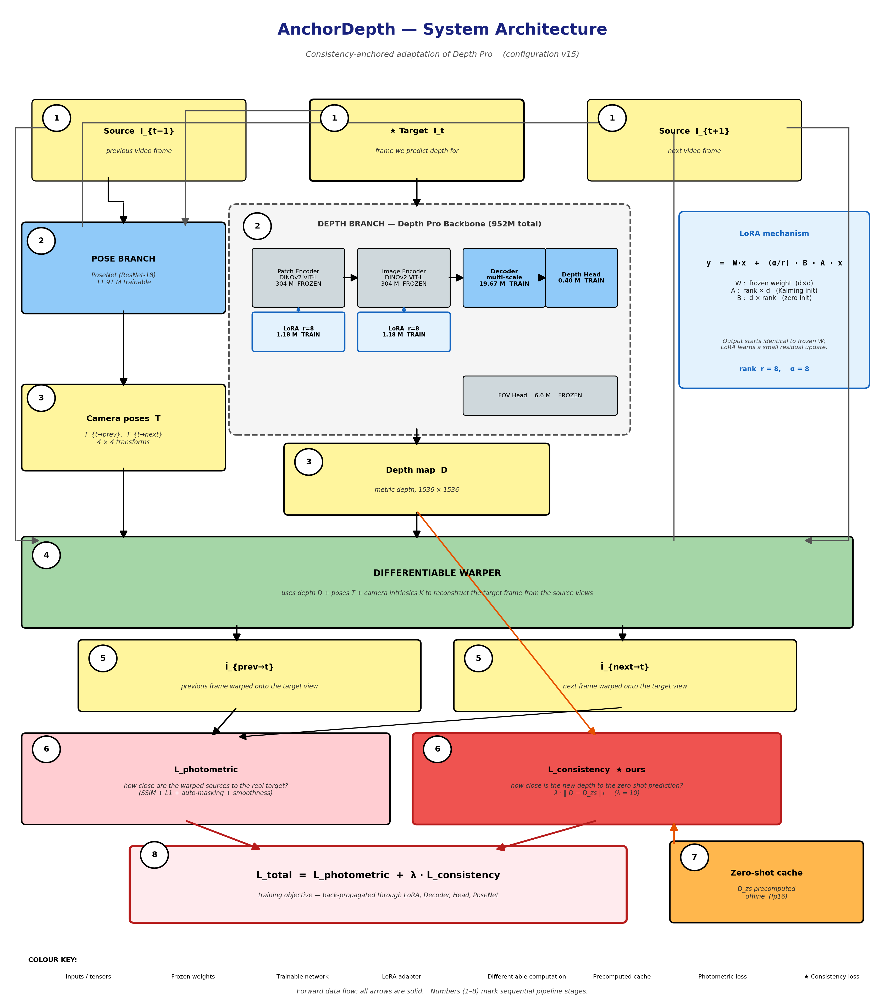
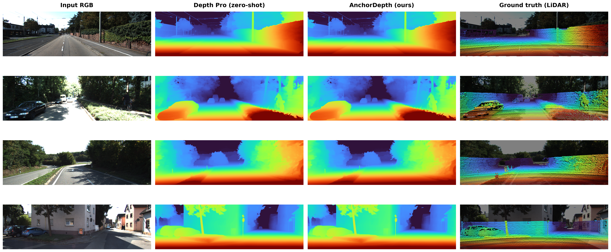
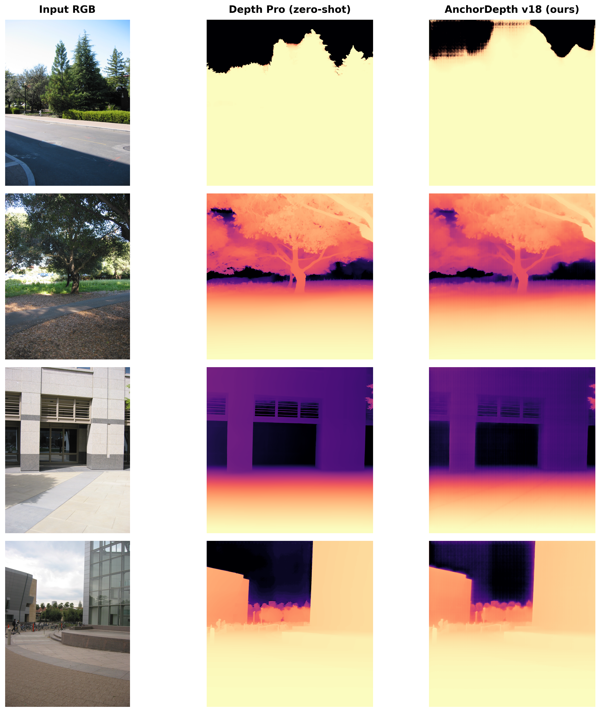
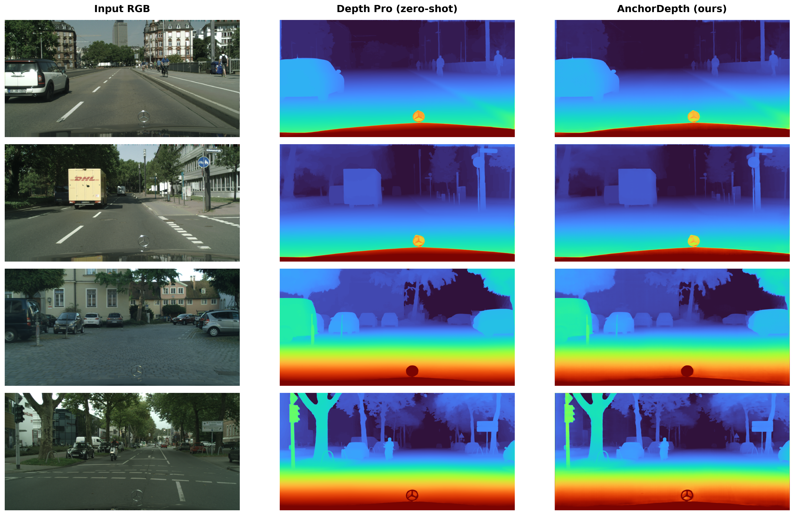

# AnchorDepth

**Consistency-Anchored Self-Supervised Adaptation of Depth Pro on Consumer GPUs**

Bachelor thesis project — Politehnica University of Timișoara, 2026.
Authored by Darius Osadici, advised on a single RTX 4070 Ti (12 GB VRAM).

AnchorDepth is a parameter-efficient self-supervised adaptation of Apple's
[Depth Pro](https://github.com/apple/ml-depth-pro) foundation model for
outdoor monocular depth estimation. It is trained on the KITTI driving
dataset using a Monodepth2-style photometric loss combined with a
**consistency anchor** that prevents the fine-tuned model from drifting
away from the strong zero-shot baseline.

> **Pretrained weights are available on Hugging Face:** 🤗
> [`dariusan3/AnchorDepth`](https://huggingface.co/dariusan3/AnchorDepth)

## Architecture



The pipeline injects LoRA adapters (rank 8) into the 96 attention layers of
Depth Pro's two ViT-Large encoders. The decoder, depth head and a ResNet-18
PoseNet are trained from scratch. The consistency loss anchors the fine-tuned
predictions to the model's own zero-shot output (precomputed offline) using a
weighted L1 distance:

L = L_photometric + λ · ‖ d_pred − d_zero-shot ‖₁

Total trainable parameters: **34 M out of 966 M (3.6%)**.

## Highlights

- **Improves over zero-shot Depth Pro on KITTI Eigen on 4 of 7 metrics** —
  AbsRel (−1.6%), RMSElog (−3.3%), δ<1.25 (+1.3 pp) and δ<1.25³, while
  staying within 1–2% on the remaining three.
- **Wins on Cityscapes (cross-domain)** — improves over zero-shot on all
  seven standard metrics (AbsRel −3.0%, RMSE −4.6%, δ<1.25 +1.76 pp).
- **Wins on Make3D (cross-domain)** — improves over zero-shot on all five
  metrics, with double-digit gains (AbsRel **−24.7%**, SqRel **−55.1%**).

## Performance

### KITTI Eigen (697 test images, median scaling)

| Method | AbsRel ↓ | RMSE ↓ | δ<1.25 ↑ | δ<1.25³ ↑ |
|--------|---------:|-------:|---------:|----------:|
| Monodepth2 (ICCV'19)    | 0.115  | 4.863 | 0.877  | 0.981   |
| MonoViT (3DV'22)        | 0.099  | 4.372 | 0.900  | 0.984   |
| Depth Pro zero-shot     | 0.0866 | **3.893** | 0.9253 | 0.98494 |
| **AnchorDepth (ours)**  | **0.0852** | 3.957 | **0.9265** | **0.98499** |

### Cityscapes (500 val images, zero-shot cross-domain)

| Method | AbsRel ↓ | RMSE ↓ | δ<1.25 ↑ |
|--------|---------:|-------:|---------:|
| Monodepth2     | 0.129 | 6.876 | 0.849 |
| ManyDepth      | 0.114 | 6.223 | 0.875 |
| Depth Pro zero-shot   | 0.1119 | 6.636 | 0.8773 |
| **AnchorDepth (ours)** | **0.1085** | **6.331** | **0.8927** |

### Make3D (134 test images, zero-shot cross-domain)

| Method | AbsRel ↓ | SqRel ↓ | RMSE ↓ | RMSElog ↓ |
|--------|---------:|--------:|-------:|----------:|
| Monodepth2     | 0.322 | 3.589 | 7.417 | 0.163  |
| CADepth-Net    | 0.312 | 3.086 | 7.066 | 0.159  |
| Depth Pro zero-shot   | 0.2575 | 4.846 | 6.677 | 0.301  |
| **AnchorDepth (ours)** | **0.1940** | **2.175** | **5.293** | **0.2555** |

## Qualitative Results

KITTI Eigen — input RGB / zero-shot / AnchorDepth (ours) / sparse LiDAR GT:


Make3D — zero-shot vs AnchorDepth:


Cityscapes — zero-shot vs AnchorDepth:


## Installation

```bash
conda create -n anchordepth -y python=3.10
conda activate anchordepth
pip install -e .
pip install huggingface_hub scipy
```

## Quick Start — Use the Pretrained Model

```python
from huggingface_hub import hf_hub_download
import torch, depth_pro
from PIL import Image
from torchvision.transforms import Normalize, ToTensor

# 1. Download model weights from Hugging Face (cached after first call)
ckpt_path = hf_hub_download(repo_id="dariusan3/AnchorDepth",
                            filename="anchordepth.pt")

# 2. Build a standard Depth Pro skeleton and load AnchorDepth weights
device = torch.device("cuda")
model, _ = depth_pro.create_model_and_transforms(device=device)
model.load_state_dict(torch.load(ckpt_path, map_location=device), strict=True)
model.eval()

# 3. Predict depth
img = Image.open("test.jpg").convert("RGB").resize((1536, 1536), Image.LANCZOS)
inp = Normalize([0.5]*3, [0.5]*3)(ToTensor()(img)).unsqueeze(0).to(device)
with torch.no_grad(), torch.amp.autocast("cuda"):
    canonical_inv_depth, fov_deg = model(inp)
    f_px = 0.5 * 1536 / torch.tan(0.5 * torch.deg2rad(fov_deg.float()))
    depth = 1.0 / torch.clamp(canonical_inv_depth * (1536 / f_px), 1e-4, 1e4)

depth_map = depth.squeeze().cpu().float().numpy()  # depth in metres
```

The LoRA adapters are merged into the base weights, so the released checkpoint
is a standard Depth Pro state dict that loads with `strict=True` and requires
**no LoRA library at inference time**.

## Reproducing the Results

```bash
# Download KITTI raw (~175 GB) — see scripts/setup/download_kitti_raw.sh
bash scripts/setup/download_kitti_raw.sh

# Precompute zero-shot Depth Pro depths (used by the consistency loss)
python precompute_zeroshot_depths.py --data-path datasets/kitti_raw --stride 6

# Train AnchorDepth (~12 h on RTX 4070 Ti, 12 GB VRAM)
bash scripts/run_v15.sh   # or run_v18.sh / run_v20.sh for cross-domain variants

# Evaluate on each dataset
python evaluate_kitti.py     --checkpoint checkpoints/selfsup_v15/selfsup_best.pt
python evaluate_cityscapes.py --checkpoint checkpoints/selfsup_v20/selfsup_best.pt
python evaluate_make3d.py    --checkpoint checkpoints/selfsup_v18/selfsup_best.pt
```

## Repository Layout

```
anchordepth/
├── train_kitti_selfsup_ms.py         training pipeline (LoRA + consistency loss)
├── evaluate_kitti.py                 KITTI Eigen evaluation
├── evaluate_cityscapes.py            Cityscapes zero-shot evaluation
├── evaluate_make3d.py                Make3D zero-shot evaluation
├── precompute_zeroshot_depths.py     offline zero-shot cache for consistency loss
├── precompute_vggt_poses.py          offline VGGT pose cache (optional)
├── export_anchordepth.py             merge LoRA into base weights → release .pt
├── src/depth_pro/                    Depth Pro reference implementation (Apple)
├── docs/THESIS_CAP1..CAP5_*.md       thesis chapters
├── results/                          evaluation JSONs + figures
└── scripts/                          training / setup bash scripts
```

## Thesis

The full thesis (in English) is available in [`docs/`](docs/):

- [Chapter 1 — Introduction](docs/THESIS_CAP1_INTRODUCTION.md)
- [Chapter 2 — Related Work](docs/THESIS_CAP2_RELATED_WORK.md)
- [Chapter 3 — Method](docs/THESIS_CAP3_METHOD.md)
- [Chapter 4 — Experiments](docs/THESIS_CAP4_EXPERIMENTS.md)
- [Chapter 5 — Conclusions](docs/THESIS_CAP5_CONCLUSIONS.md)

## Citation

```bibtex
@thesis{osadici2026anchordepth,
  title  = {AnchorDepth: Consistency-Anchored Self-Supervised Adaptation
            of Depth Pro on Consumer GPUs},
  author = {Osadici, Darius},
  year   = {2026},
  school = {Politehnica University of Timișoara},
  type   = {Bachelor's thesis}
}

@inproceedings{Bochkovskii2024:arxiv,
  author     = {Aleksei Bochkovskii and Ama\"{e}l Delaunoy and Hugo Germain and
                Marcel Santos and Yichao Zhou and Stephan R. Richter and
                Vladlen Koltun},
  title      = {Depth Pro: Sharp Monocular Metric Depth in Less Than a Second},
  booktitle  = {International Conference on Learning Representations},
  year       = {2025},
  url        = {https://arxiv.org/abs/2410.02073},
}
```

## Acknowledgements

This work builds on top of several open-source contributions:

- **Apple Depth Pro** — backbone foundation model and reference implementation.
  Code in `src/depth_pro/` is © Apple Inc., used under the
  [Apple AMLR License](LICENSE).
- **Monodepth2** (Godard et al., ICCV 2019) — photometric loss formulation.
- **LoRA** (Hu et al., ICLR 2022) — parameter-efficient fine-tuning.
- **VGGT** (Wang et al., CVPR 2025) — multi-view foundation model for the
  optional pose precomputation pipeline.

Please see [ACKNOWLEDGEMENTS.md](ACKNOWLEDGEMENTS.md) for the full list of
open-source dependencies.

## License

Code in `src/depth_pro/` is © Apple Inc. (Apple AMLR License). All
AnchorDepth-specific code (training, evaluation, consistency loss
implementation, thesis documentation) is released under the same license to
preserve compatibility with the Depth Pro backbone. See [LICENSE](LICENSE).
